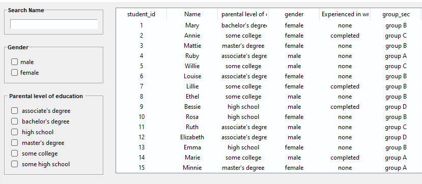
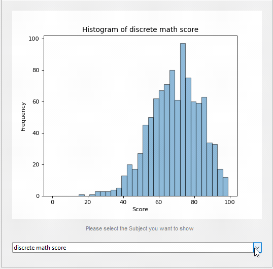
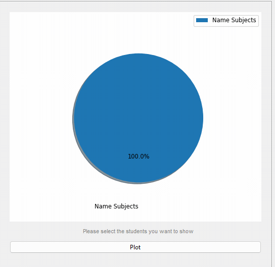
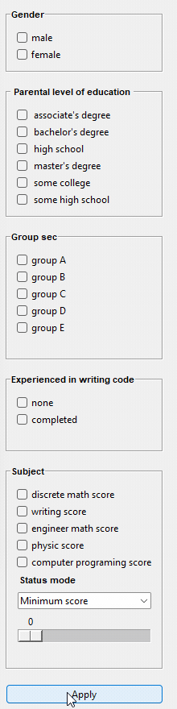
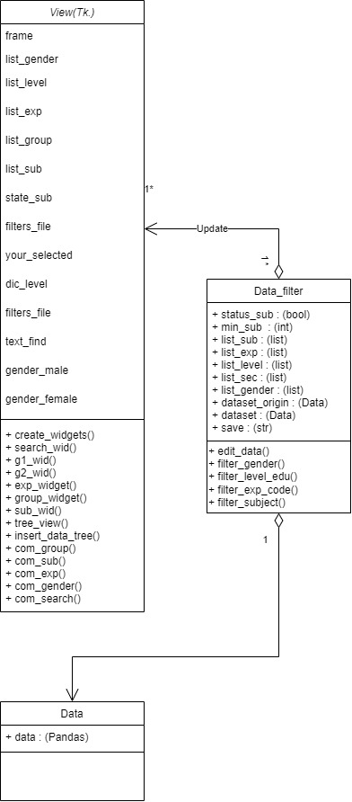

# Logic Plot score

## Description

Logic Plot score is a program that provides an overview of student scores from various perspectives to determine what
skills each student excels in and which inner skills should be enhanced.

-  
- 
- 
- 

## Running the Application

* This program uses 3 files and 1 csv file such as `StudentsPerformance_n.csv` , `display.py`  , `data.py`
  , `data_fitter.py` for run program
* So can launch the program in the file `main.py` for show display screen

## Design

This application is created to manage student information so that teachers can search for students by filtering various information and display those information. In the form of a histogram with a pie chart showing the details of
That student in each subject to see the outstanding characteristics of that student.

## Design Patterns Used

I used the patterns are `MVC pattern` and `Memento pattern` in my program between class
`Data` , `Data_filter` ,`View` All three classes work together, where data is the master data, passed to filter data,
which is the original data store, and transforms the data to be able to switch between the original data and the changed
data. and do different data to be displayed in class view. User will respond via view or gui page.
- 

## Other Information

The search box is very attractive as it can search listings in real time and display them in the tree_view. Another
feature is the filter bar, which filters out the required information. If you don't choose anything in the box, it will
be Referring to the default filter bar selection, not just one topic. but can filter multiple topics at the same time
